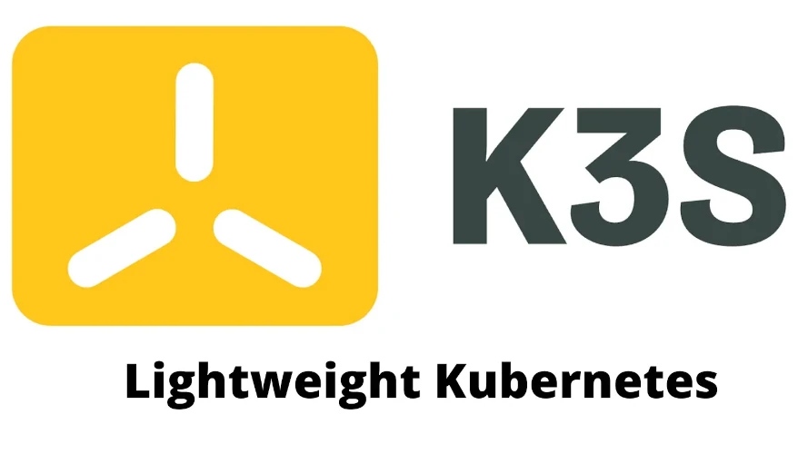
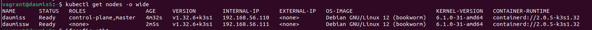

# Part1 : K3s & Vagrant


Let's start with **Vagrant**. It is a tool to automate the creation and configuration of virtual machines. Think about **Terraform** but for local VMs.

It lets developers easily:

- Spin up lightweight, reproducible environments
- Use VirtualBox, VMware, or other providers
- Write the setup in a simple file: Vagrantfile

The setup file is written in Ruby language

Here is an example of a basic Vagrantfile :

```ruby
### ------------ 📄 Vagrantfile  ------------ ###

Vagrant.configure("2") do |config|
  # Use Ubuntu 22.04 as the base box
  config.vm.box = "ubuntu/jammy64"

  # Set the VM hostname
  config.vm.hostname = "my-vm"

  # Assign a private IP address
  config.vm.network "private_network", ip: "192.168.56.10"

  # Set VM resources
  config.vm.provider "virtualbox" do |vb|
    vb.memory = 1024
    vb.cpus = 2
  end

  # Run a shell script after boot
  config.vm.provision "shell", inline: <<-SHELL
    echo "Hello World"
  SHELL
end
```

With that Vagrantfile, you will be able to create a VM provided and configured by virtualbox, running on ubuntu. All by running the command :
~~~
 $ vagrant up
~~~

> [!NOTE]  
> In this example and throughout the project, we chose **Virtualbox** as our VM provider, therefore we need it installed on our machine before executing this command.

This part of the project requires two VMs created by Vagrant in order to build a **Kubernetes** cluster with a **Server** and a **Worker** Node

## Kubernetes

**Kubernetes** (often shortened to ***K8s***) is a container orchestration tool that allows you to deploy, manage, and scale container-based infrastructures.  
It's mostly used when **scalability** is the matter, an example amongst others would be as follows :  
- If the load on your application increases, Kubernetes can automatically create new pods (copies of your application).
These additional pods will automatically receive a share of the traffic through the Kubernetes Service, which acts as an internal load balancer.
With a tool like **Docker Compose**, you would need to manually adjust the number of containers.

The subject is asking us to use **K3s** , a lightweight version of **K8s**.  



### Difference between a Server and a Worker

As said before, the subject wants us to create a Cluster by creating a K3s **Server** and a K3s **Worker** on 2 different VMs  
To put it simply, the **Server** is the brain of the cluster, it will control the cluster and manage the **Workers**.   
Here is a simple respresentation :

```
                 [ k3s Server Node ]
               ┌──────────────────────┐
               │ kube-apiserver       │
               │ scheduler            │
               │ controller-manager   │
               │ etcd / SQLite DB     │
               └──────────────────────┘
                         ↑
                         ↓
         ┌───────────────┴───────────────┐
         ↓                               ↓
 [ Worker Node 1 ]               [ Worker Node 2 ]
 ┌─────────────────┐            ┌─────────────────┐
 │   kubelet       │            │   kubelet       │
 │   containerd    │            │   containerd    │
 └─────────────────┘            └─────────────────┘
```
The **Workers** contains **Pods**, inside a Pod you will find containers that will host our app parts.  

Our Vagrant file is configured to follow the subject, it is using slightly different configuration scripts for setting up the **Server** and the **Worker** as shown below :

```sh 
### ------------ 📄 server.sh  ------------ ###

sudo apt-get update && apt-get upgrade -y

curl -sfL https://get.k3s.io | sh -s - server \
  --flannel-iface=eth1 \
  --node-ip=$SERVER_IP \
  --write-kubeconfig-mode 644

mkdir -p /vagrant/token
cp /var/lib/rancher/k3s/server/node-token /vagrant/token

```
- We specify to the installation script that we want this machine to be a K3s **Server** with the **`server`** argument.
- The **`--flannel-iface`** flag lets us forcing the usage of the eth1 interface in order to communicate with other pods.
- We then specify the **Server's** IP address.
- **`--write-kubeconfig-mode 644`** is used so we can use K3s commands with the user. (here the user is **vagrant**)  
- The last step is to copy the **token** that K3s generates and place it in ```/vagrant/token``` so it can be used by **Workers** upon configuration.

```sh 
### ------------ 📄 server_worker.sh  ------------ ###

sudo apt-get update && apt-get upgrade -y

TOKEN_FILE="/vagrant/token/node-token"

curl -sfL https://get.k3s.io | sh -s - agent \
  --server "$K3S_URL" \
  --token-file "$TOKEN_FILE" \
  --flannel-iface=eth1 \
  --node-ip="$SERVER_WORKER_IP"

```
- We specify to the installation script that we want this machine to be a K3s **Worker** with the **`agent`** argument.
- We specify what is the **Server's URL**. (something like ```"SERVER_IP:KUBERNETES_PORT"```) in order for the **Worker** to connect to it
- The generated **token** file created by the **Server** is retrieved by the **Worker** at the specified path.
- The **`--flannel-iface`** flag lets us force the usage of the eth1 in order to communicate with other pods.
- We then specify the **Worker** node's IP address.

Once everything is set, you can connect to your **Server** Machine (through SSH) and run :
``` sh
$ kubectl get nodes -o wide
```
**`-o wide`** or **`--output wide`** makes the nodes showing with the IP addresses 

You should see all of the nodes connected to your cluster with some info about them.   
Here the **Server " daumiss "** and the **Worker " daumissw "** are shown, which means we successfully created and provided two different VMs thanks to **Vagrant**, and we made the cluster as required.



### Now on to **part 2** !!