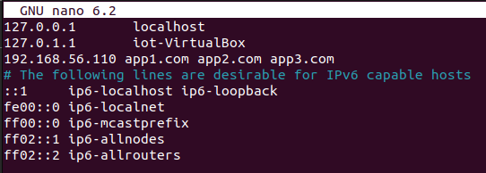
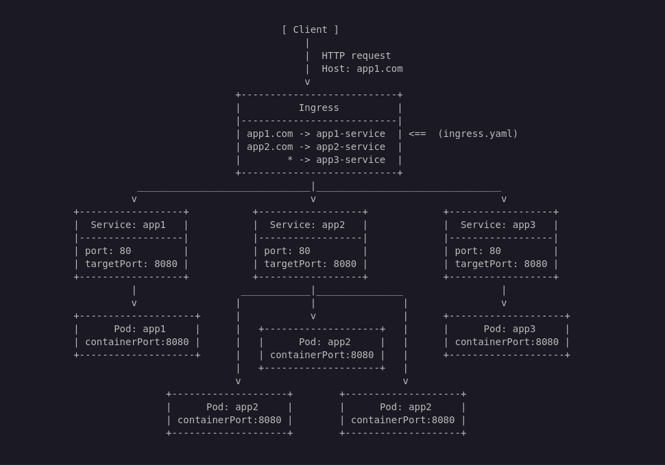
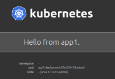
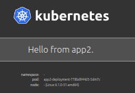
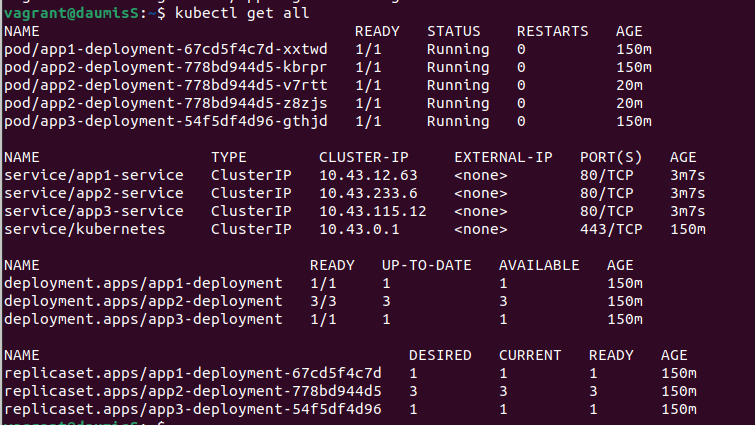

# Part 2 : K3s and three simple applications

The goal of this part is to have a more detailed understanding of K3s clusters and how they work.

The result should be as follows :

- You are able to host 3 different applications, accessible via different URLs
- All of the apps are inside **ONE** VM, which means there will be no **Worker** node on that configuration. The **Server** is the **Cluster**.
- If you don't specify the good host (app**1,2 or 3**.com), app3 is the default fallback app.  
- App2 has 3 replicas, to ensure load-balancing, scalability and availability.
- When accessing ***app1.com, app2.com and app3.com***, a "Hello from APP" is showing

> [!IMPORTANT]  
> Since we don't configure any DNS and use K3s in a dev environment : In order to type app1.com, app2.com or app3.com and access applications via your browser, you first need to modify the **`/etc/hosts`** file and add these hosts into it. Otherwise, only the IP addresses will be accessible from the browser.    
>To modify the file you need to add "`IP_ADDRESS` `Host.com Host2.com ...`" as the example below.



## Vagrant config

We do the exact same configuration as the part1 for the **Server**: same Vagrant file, same scripts.

Only a small portion of the **`server.sh`** will be modified to include the following

```sh 
### ------------ 📄 server.sh  ------------ ###

   ## former config [...]

sudo kubectl apply -f /vagrant/confs/deployment.yaml
sudo kubectl apply -f /vagrant/confs/service.yaml
sudo kubectl apply -f /vagrant/confs/ingress.yaml

```
This will apply all the settings that we will see just about now. 

> [!TIP]  
> Because this script will be running via Vagrant provisioning, we won't need to enter inside the VM and apply those changes manually (with kubectl). However, if you change anything to your yaml files later on, you **will** need to apply those changes manually.

## Ingress, Service And Deployment

This is the core of understanding on how to deploy a functionning cluster.  
First of all we should keep in mind that **Pods** and **Containers** are **NOT** initally exposed outside their **Cluster**, which means we can only access them via the cluster itself. **Ingress** will take care of that.

> [!NOTE]  
> It is also important to keep in mind that **Pod**'s IP Adresses are constantly changing upon adding,removing, rebooting etc.. Which is why K8s is such a powerful tool, with proper setup, every **Pod** is connected and automatically deployed. Thanks to K8s **Self-Healing** Capabilites. 

In order to make everything sticking and working we need to create **Kubernetes Objects** which are the **`Ingress`**, the **`Service`** and the **`Deployment`**.

Let's break down the following representation :



When the client (IE : your browser) sends an HTTP request, the **Ingress** will act as a router. It will route the traffic to the appropriate **Service** based on the request's host or path.  

The **Service** then forwards the traffic to the correct **Pods**, and also acts as a load balancer between them. This ensures that the traffic is evenly distributed, preventing a single pod from being overloaded.

**Pods** are Kubernetes objects that host your application containers. They are the endpoints that clients ultimately communicate with when sending requests through the cluster.

> [!NOTE]  
> **ONE Pod** can handle multiple containers at the same time, and **ONE Service** can handle multiple **Pods** ...  Yeah, there is a reason we call this project "***Inception*** Of Things".   
>But don't worry, for this exercise things will stay simple. As the subject requires, you can see that **app2-service** takes 3 Pods in charge to perform **load balancing**.

3 files are needed to achieve this result as said earlier, **`ingress.yaml`**, **`service.yaml`** and **`deployment.yaml`** Here are what they look like :


```yaml 
### ------------ 📄 ingress.yaml  ------------ ###

apiVersion: networking.k8s.io/v1
kind: Ingress # Kubernetes Object type
metadata:
  name: app-ingress
spec:
  ingressClassName: traefik # optionnal, defines an Ingress Controller. Here traefik by default (built in k3s)
  rules:
  - host: app1.com # Triggered when client tries to access "app1.com"
    http:
      paths:
      - path: /
        pathType: Prefix
        backend:
          service:
            name: app1-service # Name of the service that ingress will redirect to
            port:
              number: 80 # Default http port that the ingress listens to

    [...]
```

```yaml 
### ------------ 📄 service.yaml  ------------ ###

apiVersion: v1
kind: Service # Kubernetes Object type
metadata:
  name: app1-service
spec:
  selector:
    app: app1 # Selects the correct labelName of the Pod
  ports:
    - name: http
      port: 80 # Port that the Service Listens to
      targetPort: 8080 # Port that the Service will redirect to, it should match the "containerPort" of the Pod
  type: ClusterIP

    [...]
```

```yaml 
### ------------ 📄 deployment.yaml  ------------ ###

apiVersion: apps/v1
kind: Deployment # Kubernetes Object type
metadata:
  name: app1-deployment
spec:
  replicas: 1
  selector:
    matchLabels:
      app: app1 # Defines what Pod to manage
  template:
    metadata:
      labels:
        app: app1 # Label that the Deployment and the Service will manage on
    spec:
      containers:
        - name: app1
          image: paulbouwer/hello-kubernetes:1.10.1 # Hello-Kubernetes image, pulled from dockerhub
          env:
            - name: MESSAGE
              value: "Hello from app1." # Custom message to match the exercise
          ports:
            - containerPort: 8080 # Port that the container inside the pod listens to, it's informative and has no configurative purpose.
    
    [...]
```

If everything is configured correctly and applied, you should be able to access your apps by typing their URL on your browser





> [!IMPORTANT]  
> The subject also asks that if the host that the client tries to reach isn't valid (IE: idontknow.com), app3 is shown instead by default. In order to create this you must create a **catch-all** rule in the service file as follows:


```yaml 
### ------------ 📄 service.yaml ------------ ###

    [...]

  - http:
      paths:
      - path: /
        pathType: Prefix
        backend:
          service:
            name: app3-service
            port:
              number: 80
```

Note that this rule doesn't have the **`host`** tag, cause that's the default one when HTTP requests can't reach valid hostnames. It's managed by app3-service as the subject asks for. If you want to see how it redirects to app3 you can use curl :

```
$ curl -H "Host: watdahell.com" http://192.168.56.110
```

This should output the HTML of the app3 inside the console, you can check it with the **`Hello From app3`** 
```html
[...]
 <div id="message">
    Hello From app3
  <div>
[...]
```

> [!NOTE]  
> Of course, you will need curl installed on your machine if not already
>```sh 
  >$ sudo apt update
  >$ sudo apt upgrade
  >$ sudo apt install curl


This wraps up the part 2, you can see your magnificent cluster with everything deployed (and hopefully working) by connecting to your **Server** and use :
```
$ kubectl get all
```



### **Part 3** awaits, friend !