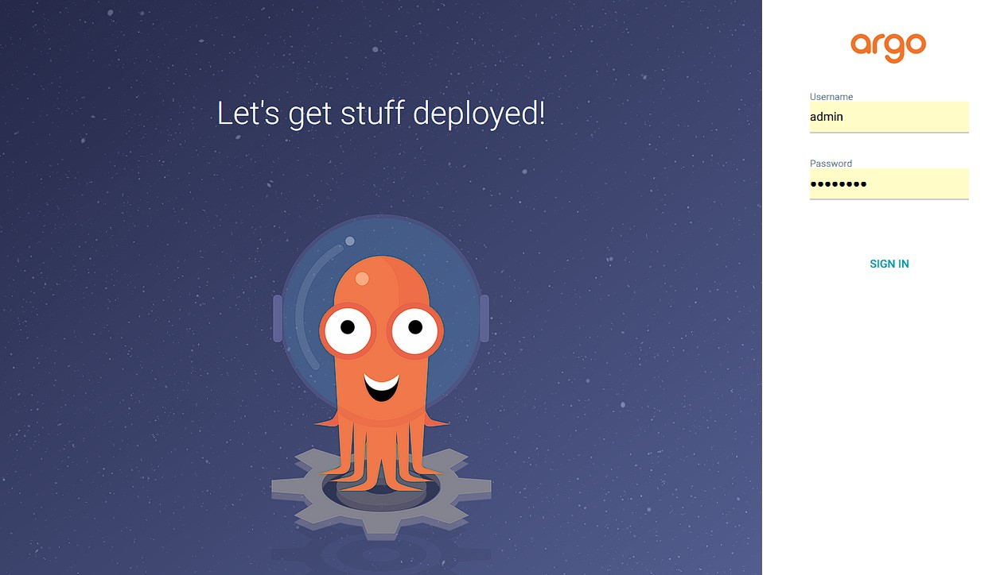

# Part 3 : K3d and Argo CD

This is the last part of the project. Inside this part we will learn about **Continuous Delivery** (CD), which is a concept that plays a big role when creating and deploying scalable apps.

Firstly, i will address the difference between **K3s** and **K3d** while we are at it, cause it's required for the project :

### K3s
As explained in part 1, **K3s** is a lightweight version of **Kubernetes** (***K8s***), it's designed to run clusters inside minimal resource environments like a VM for example.
> [!TIP]
> Fun Fact: the **'3'** in K3s is the **'8'** from K8s : split in half !
> The creators named it that way to represent the fact that K3s is less requiring then K8s.

### K3d
**K3d** is a **wrapper** for **K3s** making it run inside a **Docker Container** and also automatically configuring it. Remember the setup parts for the **Server** and/or **Workers**? It handles that automatically, so no need to grab tokens or doing manual config !

Although there are multiple tools that can be used for Continuous Delivery, we will use **ArgoCD** which is a Kubernetes-native app.

  

## How does it work, what does it do ?

ArgoCD is a tool that will let you monitor your **Kubernetes Cluster**. You will be able to see what app is runnin inside your cluster, how many pods/services you have, their sync status, etc..  
Not only that, it will also serve as an automated deployment tool, the idea is that you only need to modify a Git repository in order to make changes to your app. ArgoCD will **watch** on that repository and automatically change your app depending on what's inside the Git repo, it's called a **source of truth** and ArgoCD takes Git as it's source of truth.  

Let's say you want to have more replicas of an existing **Pod** for example.  
**Without ArgoCD** :  
- You would need to go inside your **`deployment.yaml`** file -> edit the numbers of replicas -> apply those changes with `kubectl apply -f deployment.yaml`.

**With ArgoCD** :  
- You change your deployment.yaml settings inside your Git repo manually (or by commit) -> ArgoCD **sees** that difference and automatically syncs your app. (if you actually set it to behave this way, more on that later...)  

This can also be useful for rollback purposes. As every versions of your app are in Git, you only need to revert to a certain version and ArgoCD will sync everything from that version automatically !  

Let's install it on our project !


### Installation Scripts

## Prerequisites. 

In order to complete this part , you will have to install some few prerequisites :

- Docker (So k3d can run correctly)
- K3d
- kubectl (Because it's not included inside k3d)

You will find the script to install these inside the **`p3/scripts/prerequisites_install.sh`** folder.  

I will not go through this file because it's quite self explanatory and i put some comments for guidance.  

## The Argo App

Before setting up ArgoCD, let's quick review **`p3/confs/argo-app.yaml`** as you will need it before launching the **`argo_setup.sh`** script. 

```yaml
### ------------ 📄 argo-app.yaml  ------------ ###

apiVersion: argoproj.io/v1alpha1
kind: Application
metadata:
  name: argo-instance
  namespace: argocd
spec:
  project: default 
  source:
    repoURL: https://github.com/Dylonni/iot-daumis-conf.git
    targetRevision: HEAD
    path: wil
  destination:
    server: https://kubernetes.default.svc
    namespace: dev
  syncPolicy:
    automated:
      prune: true
      selfHeal: true

```

This file ressembles **`deployment.yaml`**, **`service.yaml`** and/or **`ingress.yaml`** files. But there are some tags that needs further explanation.  

- **`repoURL`** : the github repository that ArgoCD will watch on. 
- **`targetRevision`** : the specific branch to watch on.
- **`path`** : the specific folder inside the repo to watch on. 
- **`server`** : where the apps runs (by default it's the kubernetes 'local' cluster, the one where argocd runs). 
- **`syncPolicy:automated:prune`** : deletes ressources that are not inside the Git repo anymore. 

## About selfHealing

This tag will define how your ArgoCD will react to changes.  
By default it is set to **`false`**, if you let it that way, ArgoCD will not do anything automatically.  

Let's say you want to edit the number of replicas for one of your **Pods** :

#  selfHeal : false

- **If you modify locally (without changing files on Git)** : ArgoCD will say that you are **OutOfSync**, because it's source of truth (git) doesn't have the same state as your current app. In order to get synchronized again you need to write the same changes as you did locally inside your Git repository. 
> [!CAUTION]
> You can "force" the sync inside the ArgoCD interface, and it might show that it is **Synced**. **HOWEVER** this is not really the case, as ArgoCD doesn't modify Git files on it's own, you might end up having 2 different configurations of your app without knowing which is the real one, creating a **misalignment** problem. It's important to modify Git files and not doing things locally, or if you do, ensure that you commit those changes on your Git repo. (even if it kind of defeats the point of using ArgoCD).

- **If you modify on Git** : ArgoCD will say that you are **OutOfSync**, you can press the "Sync" button to sync your app again and everything turns normal (the changes will be the ones you have made on your Git).  

#  selfHeal : true

- **If you modify locally (without changing files on Git)** :  ArgoCD will say that you are **OutOfSync**, and after some time, your cluster will get back to the **Synced** state -> ArgoCD reverted the changes you have made locally and got back to the state defined on Git.
- **If you modify on Git** :  ArgoCD will say that you are **OutOfSync** and after some time, your cluster will get back to the **Synced** state (with the changes you have made on your Git).  

## About Namespaces

A Namespace is a logical way to isolate and organize ressources, in this project we are required to create one namespace for ArgoCD (named "argocd") in which argocd will run in, and one for the development of the app (named "dev"). Every **Pod** in **dev** will not be able to communicate with a **Pod** in the **argocd** namespace for example.  

Here is a little schema about what it looks like:  
  

## Setting Up ArgoCD

> [!IMPORTANT]
> Before running the setup script, you should modify the **`argo-app.yaml`** file. Make it watch your own freshly created repository (and not mine since you can't commit anything to it).

Since the point of ArgoCD is using Git to make changes to your apps, your **`deployment.yaml`** and **`service.yaml`** files will be located in a remote git repository and no more locally. (We don't use ingress there because we are not routing traffic).  

Your repo should look like this:  

  

Once the prerequisites are installed and everything is set up, you can run **`p3/scripts/argo_setup.sh`**.  

This will install and configure ArgoCD to be accessible through your web browser. 

Again, the script is self explanatory and comments are there to explain further.

> [!IMPORTANT]
> At some point, this script will try to port forward **`wil-service`**.
> (line 105) ``` kubectl port-forward -n "$NAMESPACE_DEV" svc/wil-service 8888:8888 & ```
> if it doesn't exist inside your remote repo, the port forwarding will fail and you will not be able to access your app from your browser nor curl it. You either have to set **`wil-service`** in your **`service.yaml`** file on Git, or replace **`wil-service`** inside the **`p3/scripts/argo_setup.sh`** file with whatever your service name is on Git.  

> [!TIP]
> These scripts need to be ran in your host machine, not inside another VM that you have to make with **Vagrant** as for the previous parts. Because the whole point is to make ArgoCD and your cluster run inside a **Docker Container**, that's why we use **K3d**.  

If everything is done correctly you should be able to connect to your ArgoCD instance and have a view to your running app.

  

Feel free to try and discover the UI !  
If you want to test it, here is a simple test that you can apply :  

- Curl your app to get his message
- Go to your watched repository. 
- Inside **`deployment.yaml`**, modify **`wil42/playground:v2`** to **`wil42/playground:v1`** or vice versa.
- Refresh your ArgoCD page. 

You should see old pods getting destroyed (thanks to prune : true) and ArgoCD deploying your new apps with the correct image (v1 or v2) !  

You can also check these changes with curl:  
**Before changes on Git** :

**After changes on Git** :
  

### Congratulations !

You made it ! You now have a pretty good overview about Kubernetes Clusters and Continuous Delivery, you will now be able to respond when somebody talks about CI/CD Pipelines (well at least the CD part of it, CI is another story..)
